# RedisClientBo

RedisClientBo是一个Redis客户端软件，用来管理Redis数据，监控Redis状态，为运维、开发提供方便可视化操作功能。

下载文件后，解压，运行`RedisClientBo.exe`文件，或建立快捷方式到桌面。

第一次运行，默认配置了当前计算机的Redis和默认端口:`127.0.0.1:6379`

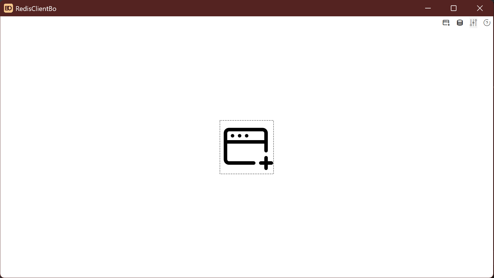

## 数据看板

点击中间的创建链接按钮，或右上角的创建链接按钮，通过菜单，创建链接。如下图

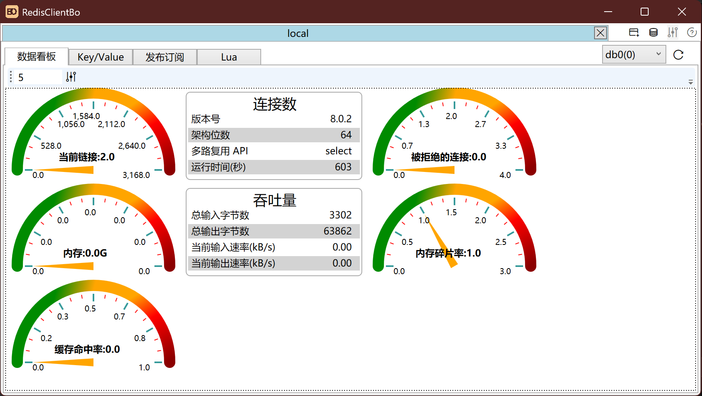

这里可以设置刷新时间，单位是秒。当设置为0时，不刷新。

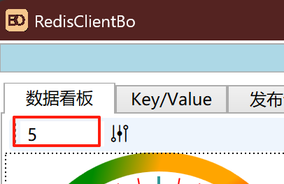

输入框后的设置按钮，打开，可以管理数据看板界面。

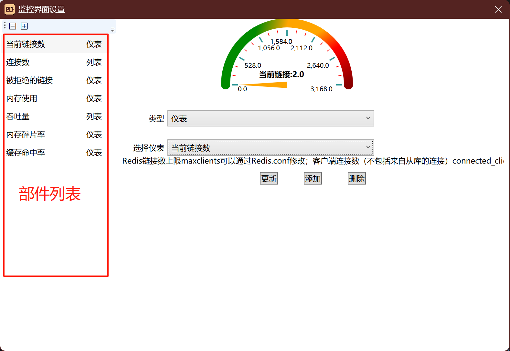

部件列表支持拖动，更改顺序。

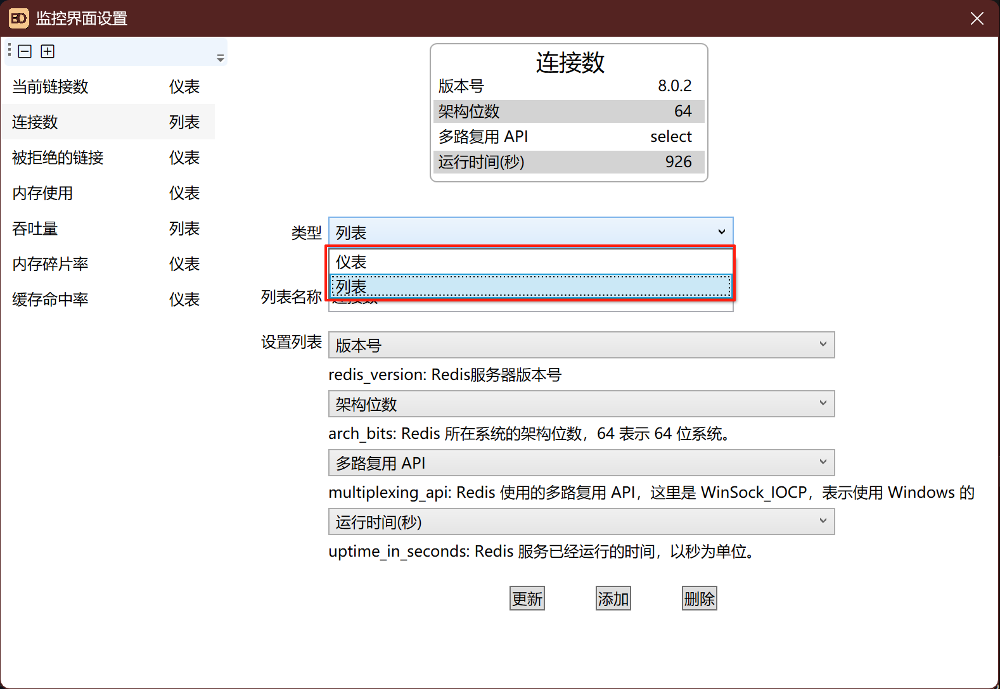

目前小部件支持列表和仪表两种，以后会根据需要增加其他表现形式。

列表支持4个数据选项，提供了服务器支持的200个数据展示。

选好选项，别忘记点击更新或添加。关闭窗口会自动保存。

## Key/Value

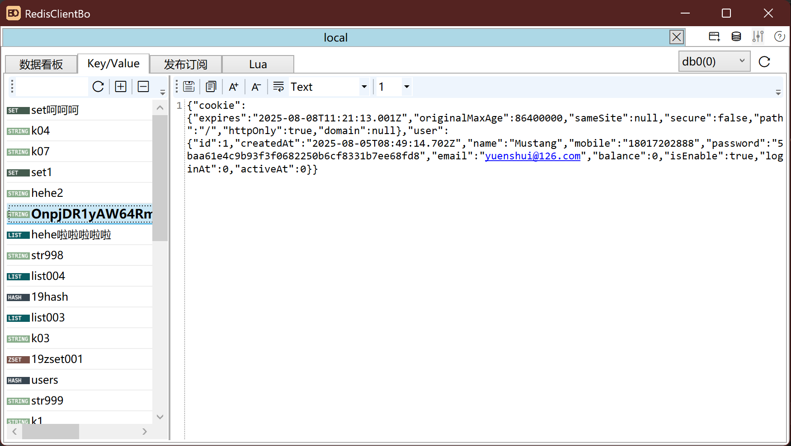

Key/Value界面是开发和访问数据最常用的界面。支持字符串(`String`)、散列(`Hash`)、列表(`List`)、集合(`Set`)、有序集合（`Sorted Set`)。

其他的数据类型，未来会支持。

`Value`编辑器支持`Unicode`、`ASCII`、`Binary`、`Hexadecimal`、`JSON`、`XML`、`HTML`、`PHPSerializer`格式显示和修改

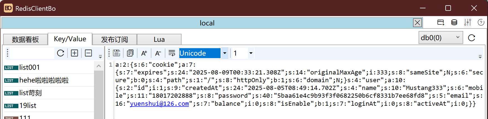

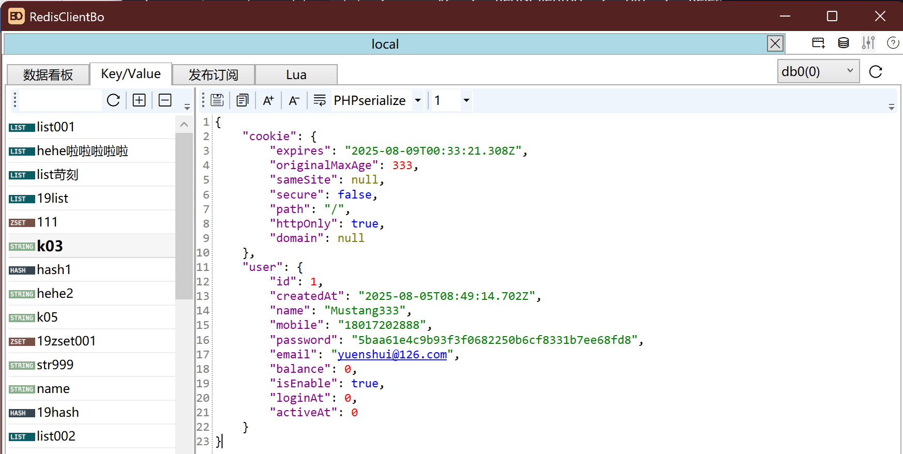

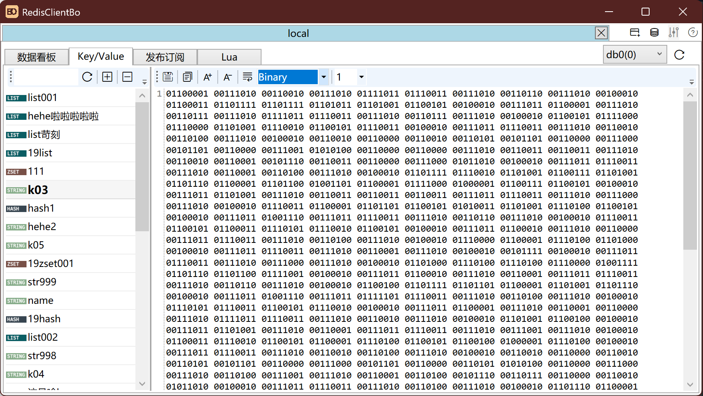

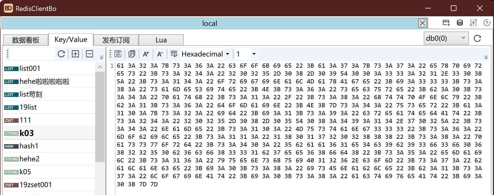

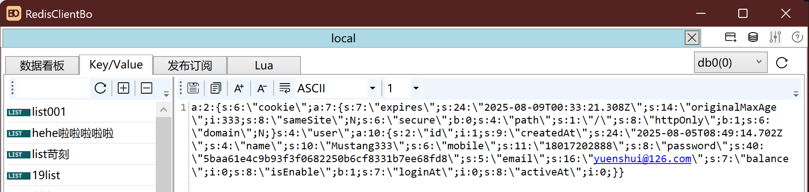

## 发布订阅(`Pub`/`Sub`)

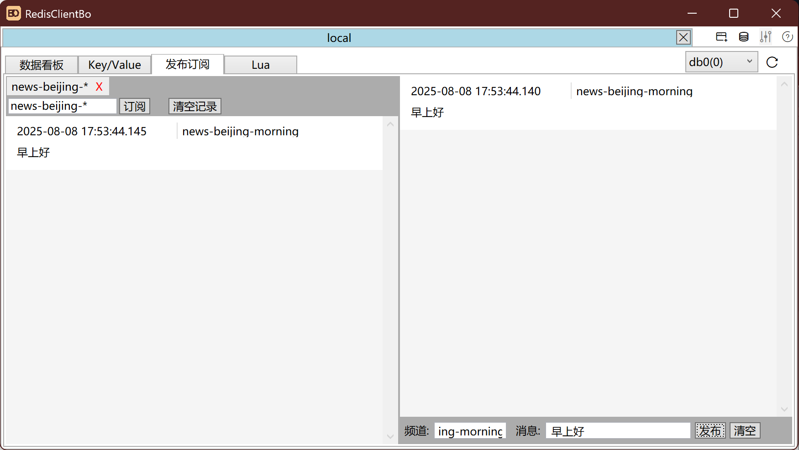

发布订阅功能可以发布和监听频道(`channel`)。

## Lua

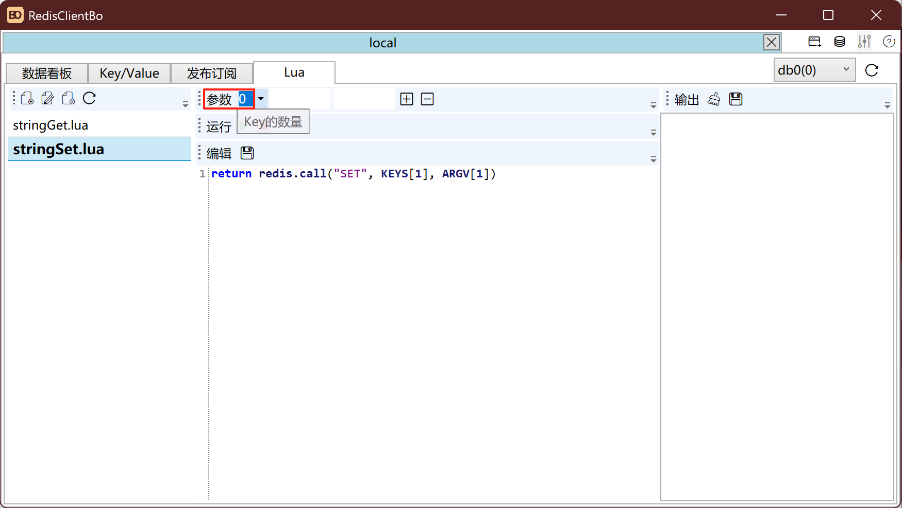

可以运行常用的所有脚本。使用参数时别忘记设置`Key`的数量，`Key`数量设置好之后，前n个参数时`KEYS`，后面的是`ARGV`。参数可以无限增加，通过添加参数按钮，鼠标悬浮在输入框上，会提示参数名。

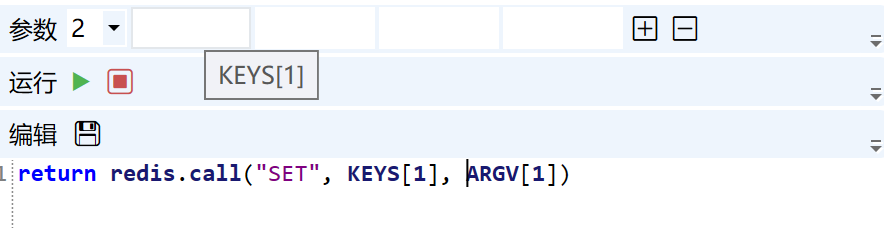

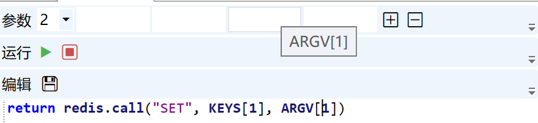

设置参数后，点击运行按钮，立即运行。

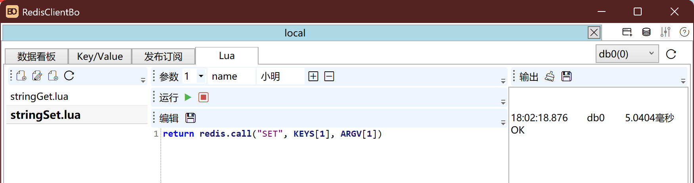

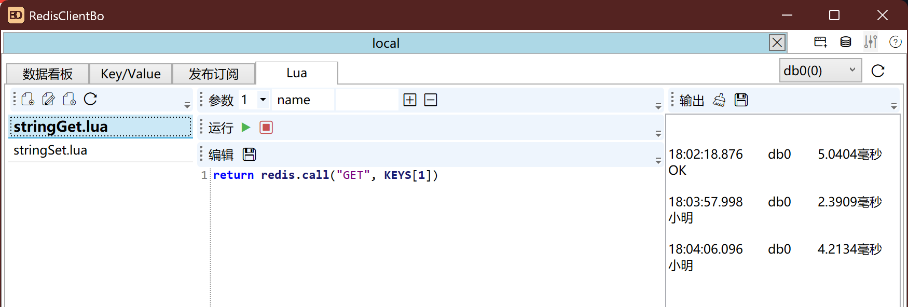

停止脚本功能在生产环境慎用。

## 管理服务器

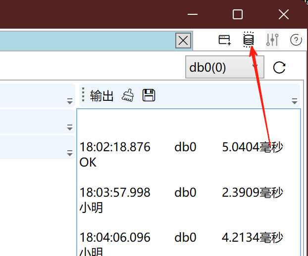

点击服务器按钮，管理服务器。

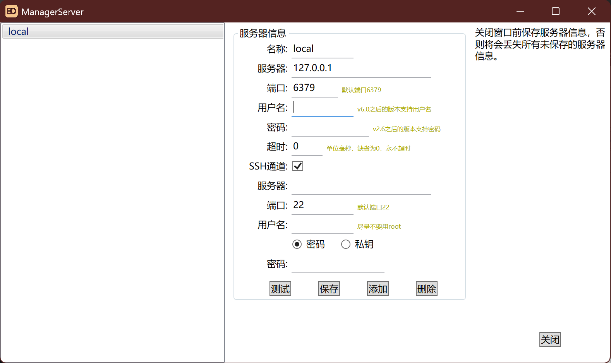

直接连接服务器，和SSH通道连接服务器。有其他应用场景的朋友，可以提出，后续完善。

## 后续

日志`Log`功能和监控`Monitor`功能，在后续开发中添加。目前处于测试状态，内置了使用期限，到期前会发布更新版本。希望朋友们能提出[宝贵意见](https://github.com/yuenshui/RedisClientBoDL/issues)。

